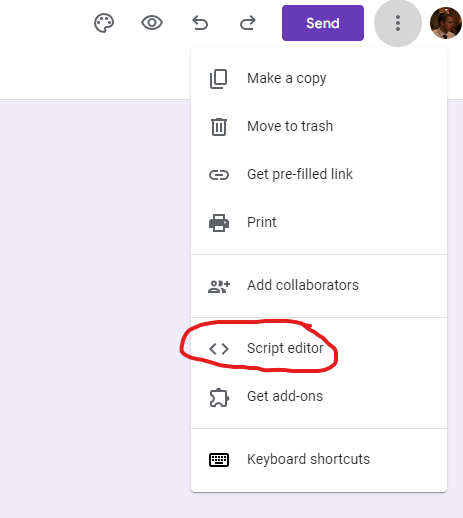
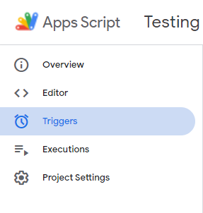
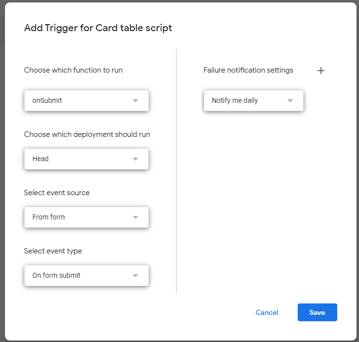

# Google Form > Basecamp tunnel

This repo has the code for a Cloudflare worker to connect a Google form and its responses to a Basecamp todo list.

Instructions for implementing this on a Google form are below.

1. Navigate to the form in edit mode and then click on this button



2. Once the script has been created, name it whatever you wish.
3. Copy and paste the following code into your script file
```javascript
const postUrl = "https://forms-basecamp-link.creativesolutions.workers.dev/"

function onSubmit(e) {
}
```
4. Now add the library to the project. 
Once you click the `+` icon next to the `Libraries` header you will be greeted with a modal that wants you to put in a project ID.
The ID of the library is `1klv2AvLhl7gGeBTJjItWbnLeKS5gRcg1jWXEpmchs27gKkBxV1gvlFaG`.
5. Add a trigger so that the script runs whenever a user submits the form.



6. Click on the `+ Add Trigger` button in the bottom right hand corner. 
7. Once the dialog opens up, change it's settings so that it looks like the picture below.



8. Click save and then agree to let the app access the form in the popup.
9. Now it's time to start coding. 

You can access the form using `FormApp.getActiveForm()`.
There's a helper function included in the library for itemizing the form into a map.
You can call that using `CloudflareLibrary.getFormItems(FormApp.getActiveForm())`.
An example of what can be done with this library is below.

## Example AppScript Implementation
```javascript
const postUrl = "https://forms-basecamp-link.creativesolutions.workers.dev/"
const locations = {
  "Graphic": "5923891441",
  "Video": "5924038563",
  "Photo": "5924039801",
  "Social": "5924041099",
}

function onSubmit(e) {
  const formItems = CloudflareLibrary.getFormItems(FormApp.getActiveForm());
  const requestType = formItems["Request Type"].split(" ")[0];

  let content = `
    <h1>${formItems["Event/Service/Program Name"]}</h1>
    <h2>${formItems["Event/Service/Program Date"]}</h3>
    <h3>Customer:</h3>
    <p>${formItems["Event/Service/Program Desired Customer"]}</p>
    <h3>Description & Creative Ideation</h3>
    <p>${formItems["Event/Service/Program Description & Creative Ideation"]}</p>
    <h3>Graphic Desgin Assets Requested</h3>
    <p>${formItems["Event/Service/Program Graphic Design Asset Requested"].reduce((previous, current) => `${previous}${current}, `, "").slice(0, -2)}</p>
    <h3>This request has ${formItems["Approved by your Group Leader"] === "Yes" ? "" : "not "}been approved by the requester's group leader</h3>
  `;

  CloudflareLibrary.sendDataToCloudflare({
    postURL,
    type: "card_table",
    projectId: "31912256",
    subId: locations[requestType],
    title: `${formItems["Event/Service/Program Name"]} Request`,
    content,
    due_on: formItems["Proposed Due Date"],
  });
}
```